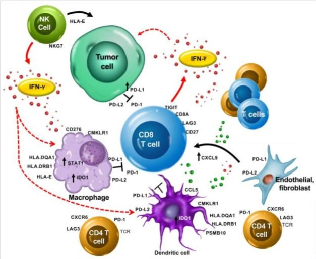
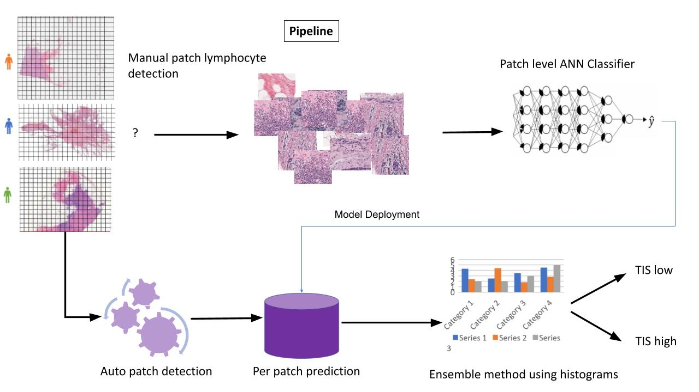

# Tumor Inflammation Signature Prediction Project

* Checkpoint inhibitor immunotherapy is a form of cancer treatment that blocks specific proteins on immune cells or cancer cells, known as immune checkpoints. These checkpoints act as brakes to dampen the
  immune system's response to cancer. By using antibodies or other agents to inhibit these checkpoint proteins, these drugs release the brakes on the immune system, enhancing its ability to recognize and attack
  cancer cells. Key checkpoint proteins targeted by these drugs include PD-1, PD-L1, and CTLA-4. Blocking these pathways augments anti-tumor immunity, leading to durable clinical responses in some patients.
  Checkpoint inhibitors such as pembrolizumab, nivolumab, and ipilimumab have demonstrated efficacy against melanoma, lung cancer, and other malignancies. However, only a subset of patients respond, highlighting
  the need for biomarkers to guide patient selection.Ongoing research aims to expand the utility of checkpoint blockade across cancer types and improve patient outcomes through combination therapies.

* Despite promising results, only a small proportion of patients with advanced cancer respond favorably to checkpoint inhibitor immunotherapy. The majority of patients undergo unnecessary exposure to expensive
  yet ineffective drugs with potentially toxic side effects. The medical community is actively investigating biomarkers that can reliably predict patient responsiveness to these biological therapies. To date,
  the only FDA-approved predictor is PD-L1 expression measured by immunohistochemistry (IHC). Another emerging IHC-based test is ImmunoScore, which quantifies immune cell densities within the tumor
  microenvironment. Additional biomarkers under investigation include mismatch repair (MMR) deficiency, microsatellite instability (MSI), and tumor mutational burden (TMB). Though these tests show early promise,
  larger validation studies are needed to confirm their utility for response prediction and guide more personalized, precise use of checkpoint blockade therapy.

* In this project, my partner and I researched a biomarker called TIS - Tumor Inflammation Signature.
  + Developed by Ayers et. al. (2017) - IFN-Gamma-related mRNA profile predicts clinical response to PD-1 blockade. https://www.jci.org/articles/view/91190
  + Formula made of RNA expression of 18 genes (Antigen presentation, chemokine expression, cytotoxic activity, adaptive immune resistance, interferon gamma activity)
  + PSMB10, HLA-DQA1, HLA-DRB1, CMKLR1, HLA-E, NKG7, CD8A, CCL5, CXCL9, CD27, CXCR6, IDO1, STAT1, TIGIT, LAG3, CD274, PDCD1LG2, CD276
  + High score should indicate success of using Pembrolizumab.

# TCGA - The Cancer Genome Atlas (TCGA) database

* TCGA was a landmark cancer genomics program led by the National Cancer Institute and National Human Genome Research Institute from 2006-2015. 
* It systematically mapped the genomic changes in over 20,000 primary cancer samples across 33 tumor types.
* TCGA performed integrated multi-dimensional analysis including whole exome sequencing, copy number, methylation, expression analysis and proteomics on each sample.
* All TCGA data is freely available through the Genomic Data Commons portal and has led to many insights into cancer biology and precision medicine. 

* The idea is to use the TCGA high resolution SVS images of patients, together with their genomic data, and using deep neural network to try predicting the TIS values.
* The main problem when working with high resolution biopsies data of this kind, is how to handle the size of the image. SVS image can be as large as 3 Giga bytes, and it does not fit the current architectures of
  neural networks. What all researchers do is split the images to areas of interest (aoi) in the image, usually these are areas where there are lots of lymphocytes, or where the tumor is located, and train the neural net only on these areas, or patches. Finally, another model is trained in order to combine the results of all the different patches. Along the years various architectures have been developed around these
  two different models, the classifier and the combiner.

# TIS Project Pipelin

* The first step is downloading the SVS files from TCGA. This can be donw using manifests. We downloaded the BRCA patients (see gdc-client.exe and the manifests files in the code folder).
* Next, our supervisor Professor Efroni connected us with one of his colleagues, a researcher from Ichilov Hospital, who was able to provide us access to a professional pathologist. With her guidance, we trained a group of students to mark and label regions of interest across the SVS slides in our breast cancer dataset. This allowed us to generate a large labeled training set to develop our deep learning model. The pathologist helped identify clinically relevant areas and key features for the students to focus on during the annotation process. By leveraging the pathologist's expertise, we ensured our training data had accurate, high-quality labels across numerous whole slide images. This critical preparation enabled us to apply deep learning to analyze the complex histology patterns in our unique biopsy dataset from breast cancer patients.
* After the labeling process, the next step was to split the large SVS files into smaller image patches based on the students' markings. We also performed some image preprocessing on the patches, including color correction, blurring, and other transformations. This was implemented in the image_processing.py script. Preprocessing the image patches was an important step to normalize the appearance of the histology slides and prepare the data for model training.
* Next, we trained a classifier only on the relevant patches, trying to predict the TIS class, low or high. low means TIS score < 0.5, and high otherwise. The basic model ia Alexnet, and we used transfer learning. Loss is binary cross entropy, and metric is AUC (see code folder).
* The final component was training a model to aggregate the patch-level predictions into an overall slide-level output. For this combiner model, we used a tabular learner from the fastai library. The input to this model was the distribution of TIS scores predicted by the CNN for each patch across a whole slide image. The combiner model learned to analyze the shape of this score distribution to arrive at a final slide-level prediction. By training the tabular learner on top of the CNN patch classifier, we could effectively integrate the histological patterns detected across an entire SVS slide. This two-step process - first extracting features from image patches, then contextualizing the outputs for the whole slide - enabled robust computational pathology predictions from our breast cancer biopsy data. The combiner model tied together the patch classification results into a biologically coherent outcome for each patient sample (file tis-alexnet-histogram-tabular.py).